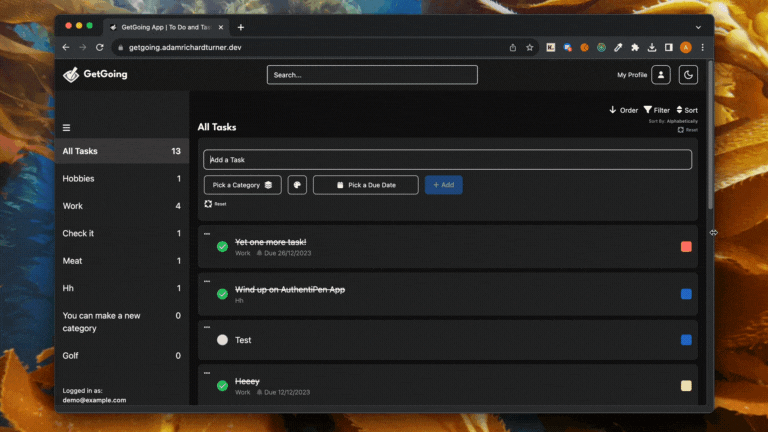

# GetGoing | Next.js + Supabase To Do List App

GetGoing revolutionizes the way you manage your tasks by offering a vibrant, category-based, task management system.

Both Front end and Back end are handled by Next.js using App Router, with all code written primarily in TypeScript, with Tailwind for styling along with the Shadcn UI component library.

User data and authentication is securely stored and handled by Supabase.



## Tech Stack

- [TypeScript](https://www.typescriptlang.org/)
- [Tailwind CSS](https://tailwindcss.com)
- [Shadcn UI Component Library](https://ui.shadcn.com/)
- [Next.js](https://nextjs.org) stack
  - App Router
  - Middleware
  - Client
  - Server
- [Supabase PostgreSQL](https://supabase.com/)
  - supabase-ssr. A package to configure Supabase Auth to use cookies

## Features

- Add, Edit and Delete Tasks: Categorise, color code and set due dates. Edit and delete tasks.
- Categories: Create up to 8 categories to store your tasks.
- Fluid UI: Works across devices and adapts to screen sizes responsively.

In the future I plan to add drag and drop functionality with React DND and OpenAuth compatibility with Google and GitHub OAuth.

## Demo

You can view a fully working demo at [https://getgoingapp.io](https://getgoingapp.io).

Username: **demo@example.com**
Password: **demo**

## Clone and run locally

1. You'll first need a Supabase project which can be made [via the Supabase dashboard](https://database.new)

2. Create a Next.js app using the Supabase Starter template npx command

   ```bash
   npx create-next-app -e with-supabase
   ```

3. Use `cd` to change into the app's directory

   ```bash
   cd name-of-new-app
   ```

4. Rename `.env.local.example` to `.env.local` and update the following:

   ```
   NEXT_PUBLIC_SUPABASE_URL=[INSERT SUPABASE PROJECT URL]
   NEXT_PUBLIC_SUPABASE_ANON_KEY=[INSERT SUPABASE PROJECT API ANON KEY]
   ```

   Both `NEXT_PUBLIC_SUPABASE_URL` and `NEXT_PUBLIC_SUPABASE_ANON_KEY` can be found in [your Supabase project's API settings](https://app.supabase.com/project/_/settings/api)

5. You can now run the Next.js local development server:

   ```bash
   npm run dev
   ```

   The starter kit should now be running on [localhost:3000](http://localhost:3000/).

> Check out [the docs for Local Development](https://supabase.com/docs/guides/getting-started/local-development) to also run Supabase locally.
