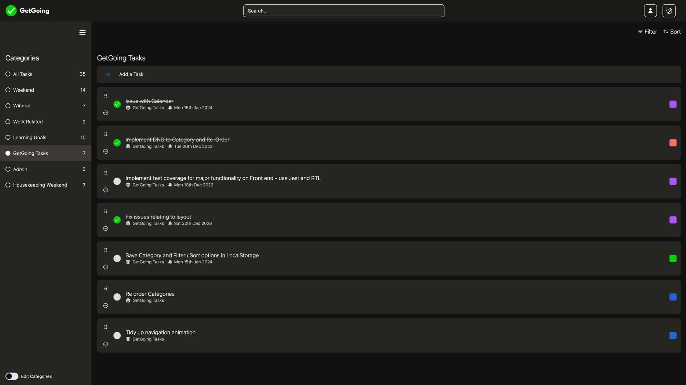

# GetGoing | Next.js + Supabase To Do List

GetGoing revolutionises the way you manage your tasks, offering a vibrant, category-based, task management system.

Tasks can be organised, filtered and sorted in a number of ways: including reorderable task lists, together with drag and drop functionality.

Both Front end and Back end are handled by Next.js, using App Router & Next's Routing Handlers, with all code written primarily in TypeScript.

Disclaimer:
**This project is "Work in Progress" and is intended for demonstration use only.**



## Tech Stack

- [TypeScript](https://www.typescriptlang.org/)
- [Tailwind CSS](https://tailwindcss.com)
- [Shadcn UI Component Library](https://ui.shadcn.com/)
- [Next.js](https://nextjs.org) stack
  - App Router
  - Route Handlers
  - Middleware
  - Client
  - Server
- [Supabase PostgreSQL](https://supabase.com/)
  - [Supabase Auth with Cookie based Sessions](https://github.com/supabase/auth-helpers)
  - supabase-ssr. A package to configure Supabase Auth to use cookies
- [ReactDND](https://react-dnd.github.io/react-dnd/about)
- [Framer Motion](https://www.framer.com/motion/)

## Features

- Add, Edit and Delete Tasks.
- Categorise, color code and set due dates on tasks.
- Re-order tasks by dragging and respositioning them on the Y axis, where no filters or sorting is applied.
- Create up to 7 categories to store your tasks by topic or area, or view all of them.
- Filter by Completion, Due Date, Category & Colour.
- Sort by Due Date, Alphabhetically, Creation Date, Last Updated or Show All.
- Drag and Drop tasks into categories using a drag handle.
- Fluid UI: Works across devices and adapts to screen sizes responsively.
- Subtle animations written with Framer Motion.

## Demo

You can register for an account by visiting [https://getgoingapp.io/signup](https://getgoingapp.io/signup).

Create an account with your chosen email and password, confirm your account by clicking the link an email sent, then login.

## Clone and run locally

1. You'll first need a Supabase project which can be made [via the Supabase dashboard](https://database.new)

2. The database model used for this project can be found in sql.db at the project root. You will need to execute those SQL queries in Supabase before proceeding to the next step.

3. Clone the project in a directory of your choice

   ```bash
   git clone https://github.com/adamrichardturner/getgoing.git
   npm install
   ```

4. Use `cd` to change into the app's directory

   ```bash
   cd getgoing
   ```

5. Create a `.env.local` file in the project root and add the following, replacing the relevant placeholders with your project URL and API key from Supabase:

   ```
   NEXT_PUBLIC_SUPABASE_URL=[INSERT SUPABASE PROJECT URL]
   NEXT_PUBLIC_SUPABASE_ANON_KEY=[INSERT SUPABASE PROJECT API ANON KEY]
   ```

   Both `NEXT_PUBLIC_SUPABASE_URL` and `NEXT_PUBLIC_SUPABASE_ANON_KEY` can be found in [your Supabase project's API settings](https://app.supabase.com/project/_/settings/api)

6. You can now run the Next.js local development server:

   ```bash
   npm run dev
   ```

7. To build the project, simply use the following command, and deploy the .next build directory as appropriate in your chosen hosting environment.

   ```bash
   npm run build
   ```
